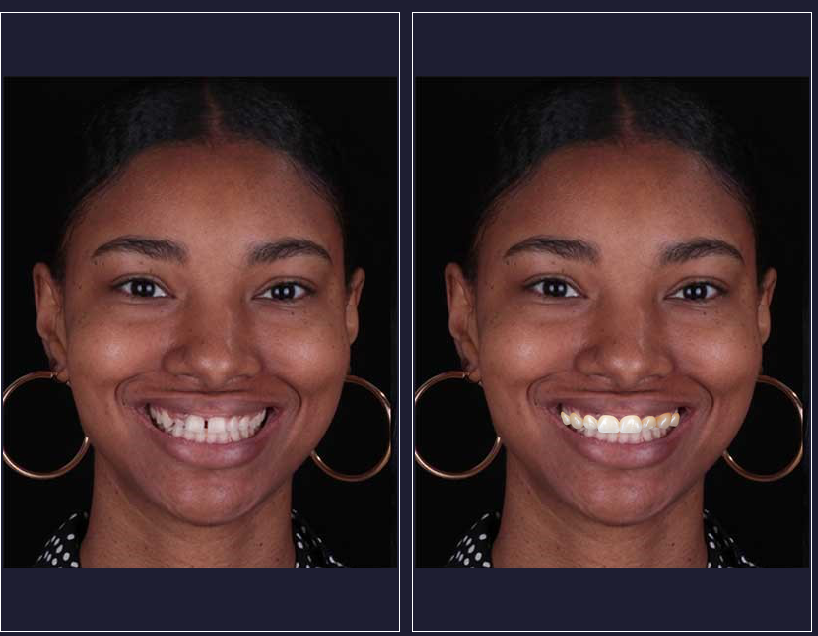

<div id="top"></div>


<!-- TABLE OF CONTENTS -->
<details>
  <summary>Table of Contents</summary>
  <ol>
    <li>
      <a href="#about-the-project">About The Project</a>
      <ul>
        <li><a href="#built-with">Built With</a></li>
      </ul>
    </li>
    <li>
      <a href="#getting-started">Getting Started</a>
      <ul>
        <li><a href="#prerequisites">Prerequisites</a></li>
        <li><a href="#installation">Installation</a></li>
      </ul>
    </li>
    <li><a href="#usage">Usage</a></li>
    <li><a href="#license">License</a></li>
    <li><a href="#contact">Contact</a></li>
  </ol>
</details>
<br /><br />

<!-- ABOUT THE PROJECT -->
## **About The Project**
\
Digital smile design is a unique dental treatment
planning tool that strengthens a dental provider’s diagnostic
vision, enhances predictability, and improves communication
between dental providers and their patients. We’ve designed a
software solution that is easy to use for everyone. The software
can detect 4 defects in a person’s smile. Moreover, it provides
some solutions and templates to change these defects. The
software works with high accuracy and time effeciency compared
to traditional methods.


<p align="right">(<a href="#top">back to top</a>)</p>


### **Built With**

* [Python3](https://www.python.org/download/releases/3.0/)
* [PyQt5](https://pypi.org/project/PyQt5/)
* [Dlib](https://pypi.org/project/dlib/)
* [Scikit-image](https://pypi.org/project/scikit-image/)
* [Opencv](https://pypi.org/project/opencv-python/)

<p align="right">(<a href="#top">back to top</a>)</p>


<!-- GETTING STARTED -->
## **Getting Started**

Before isntalling the required libraries, make sure to have python3 installed.

### Prerequisites

* [Python3](https://www.python.org/download/releases/3.0/)
  

### Installation

1. Clone the repository
   ```sh
   https://github.com/ahmed-sedky/smile-design.git
   ```

2. Install PyQt5 packages
   ```sh
   pip install PyQt5
   ```

3. Install Dlib package
   ```sh
   pip install dlib
   ```
4. Install Scikit-image packages
   ```sh
   pip install scikit-image
   ```

5. Install Opencv packages
   ```sh
   pip install opencv-python
   pip install opencv-contrib-python
   ```
  
6. Download the `setup` folder that contains `data.dat` file. Extract it in the project directory; the project folder should look like the one attached below:
   ```
   https://drive.google.com/file/d/1rz4uclaSn2P2sfGbuoSqPKAxINrWT6VB/view?usp=sharing
   ```
    


7. If you have any problems installing one of the packages, you may run this command to install the exact versions of the mentioned packages in `requirements.txt`.
 **(This step is not necessary)**
   ```sh
   pip install -r ./requirements.txt
   ```
  
<p align="right">(<a href="#top">back to top</a>)</p>


<!-- USAGE EXAMPLES -->
## **Usage**

First, you need to run `app.py`. The GUI shown should be as the one attached below. \

<br /><br />

On the toolbar, click on file, then open image(or just use the hotkey Ctrl+O) and pick the image file (supports different type of images). \
 
<br /><br />

After loading the image properly, the result will popup as a message box like the screenshot attached below.
\

<br /><br />

After closing `Results window`, you will be able to select the template shape or adjust teeth color using the following dropdown menus.
\

<br /><br />

You should be able to adjust the template on the smile freely while comparing the results with the 'before' picture on the left side of the program as shown.
\

<br /><br />

From the toolbar, you can rescale the template to match the face provided. Remember that you can always reopen the results widnow by pressing the hotkey (Ctrl+A)\
You can select another image and start over using the same steps as above. 
<br /><br />

<p align="right">(<a href="#top">back to top</a>)</p>


<!-- LICENSE -->
## **License**

This project is a part of the SBE-462 course (Biometrics) in the [Systems and Biomedical Engineering Department - Cairo University]
 
PROF. Ahmed Badawi\
TA. Laila Abbas

<p align="right">(<a href="#top">back to top</a>)</p>


<!-- CONTACT -->
## **Contact**

* Mostafa Mahmoud - (https://github.com/MostafaAbbas-git)

* Ahmed Abdelfatah - (https://github.com/Ta7a21)

* Ehab Wahba - (https://github.com/ehab74)

* Mohaned Alaa - (https://github.com/Mohanedalaa)

* Mo'men Maged - (https://github.com/mmn420)

* Ahmed Sedky - (https://github.com/ahmed-sedky)

<p align="right">(<a href="#top">back to top</a>)</p>

